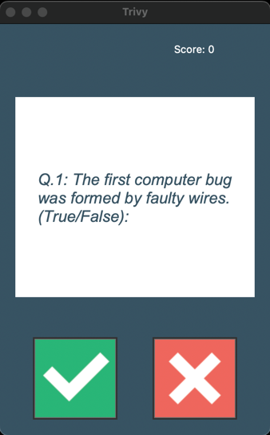

# Trivy
This project is a simple true false trivia game.



## Installation
1. Create a directory on your machine to house it. I find "TRIVIA" to be a good fit!
```commandline
mkdir TRIVIA 
```
2. Look above and select "Code"
3. From here, copy HTTPS web URL
4. Return to your terminal and clone the repo.
```commandline
git clone https://github.com/LanoCodes/Trivy.git
```
5. Using your favorite IDE, open the TRIVIA folder.
6. Navigate to main and run the program from there. You will need the tkinter package installed.

## Usage
- In the window that appears (shown above), you will have the choice between two true or false buttons, shown respectively.
- As you press one based on whether you think the question is true or false, you'll be indicated whether you were correct.
- There will be 10 questions total and the score indicator resets every time the program is rerun.